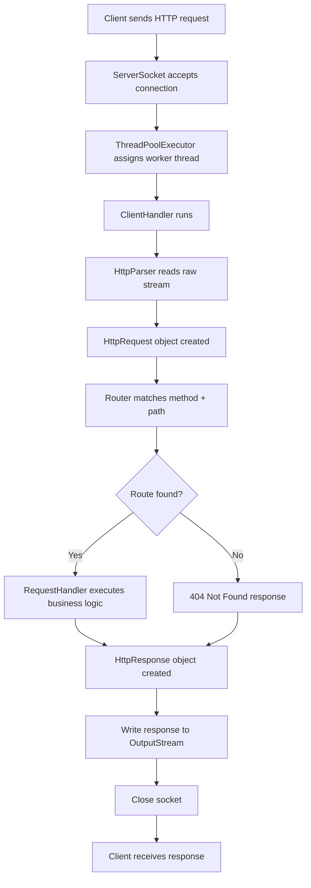

# Java HTTP Web Server Project

This project demonstrates how a simple web server works in Java using sockets, HTTP parsing, routing, and thread pooling. It includes three versions:

- Single-threaded server
- Multi-threaded server
- Thread-pool-based server

The main implementation is in the ThreadPool folder, which is the most efficient and scalable version.

---

## Overview

A browser or client sends an HTTP request to the server over TCP. The server accepts the connection, reads the incoming data, parses the request, routes it to the right handler, and sends back an HTTP response.

The project is built from scratch without using any external web framework. It shows how backend servers work internally at a low level.

---

## Working Flow Diagram



---

## Step-by-Step Explanation

### 1. Server starts and listens
The server creates a ServerSocket on a chosen port, such as 8080. It keeps listening for incoming client connections in a loop.

### 2. A connection is accepted
When a client connects, the server accepts the socket connection. This socket represents the communication channel between the client and server.

### 3. Work is submitted to the thread pool
Instead of creating a new thread for every request, the server uses ThreadPoolExecutor. This allows multiple requests to be processed efficiently while managing resources properly.

### 4. ClientHandler processes the request
Each request is handled by a ClientHandler object. This class is responsible for reading input from the socket, parsing the HTTP message, generating a response, and sending it back.

### 5. HttpParser reads the raw HTTP data
The incoming socket stream contains the HTTP request text, such as:

```http
GET / HTTP/1.1
Host: localhost:8080

```

The HttpParser reads this data and converts it into an HttpRequest object containing:

- HTTP method
- path
- protocol version
- headers
- request body (if present)

### 6. Router decides what to do
The Router maps routes like:

- GET /
- GET /metrics

to specific handler methods. It looks up the request method and path and decides which logic should process the request.

### 7. RequestHandler executes the business logic
The matched handler builds an HttpResponse object. This response contains:

- status code (such as 200 or 404)
- response headers
- response body
- content type

### 8. Response is sent back to the client
The ClientHandler writes the response bytes to the output stream and flushes it. The client receives the HTTP response and the socket is closed.

---

## Why Thread Pool is Better

This project uses a thread pool instead of creating a new thread for every request:

- better resource usage
- fewer threads created
- handles multiple client requests more efficiently
- reduces memory pressure
- improves server scalability

The server also includes graceful shutdown logic so it stops accepting new connections and lets current requests finish before closing.

---

## Project Structure

```text
MultithreadedWebServer/
├── README.md
├── Multithreaded/
│   ├── Client.java
│   └── Server.java
├── SingleThreaded/
│   ├── Client.java
│   └── Server.java
└── ThreadPool/
    ├── ClientHandler.java
    ├── HttpParser.java
    ├── HttpRequest.java
    ├── HttpResponse.java
    ├── RequestHandler.java
    ├── Router.java
    └── Server.java
```

---

## Main Components

### Server.java
Starts the server, listens for incoming sockets, and submits tasks to the thread pool.

### ClientHandler.java
Handles the processing of one client request from socket input to socket output.

### HttpParser.java
Parses raw HTTP input into a structured request object.

### Router.java
Matches the route requested by the client with the proper handler.

### RequestHandler.java
Defines the interface for request processing logic.

### HttpRequest.java and HttpResponse.java
Represent the request and response objects used during communication.

---

## Simple Example

When the client requests:

```text
GET / HTTP/1.1
```

the flow is:

1. Server accepts connection
2. Thread pool picks a worker
3. ClientHandler reads the request
4. Parser creates an HttpRequest
5. Router finds the handler for `/`
6. Handler returns an HTML response
7. Server sends response back
8. Socket closes

---

## Run the Project

From the project root, compile and run the Java classes with the Java compiler and runtime.

Example:

```bash
cd ThreadPool
javac *.java
java Server
```

Then open a browser or use curl:

```bash
curl http://localhost:8080/
curl http://localhost:8080/metrics
```

---

## Conclusion

This project is a practical example of how a real web server works internally. It shows the core concepts of:

- socket communication
- HTTP parsing
- request routing
- response generation
- concurrency with thread pools
- graceful shutdown

It is a great beginner-friendly project for understanding backend server architecture in Java.
